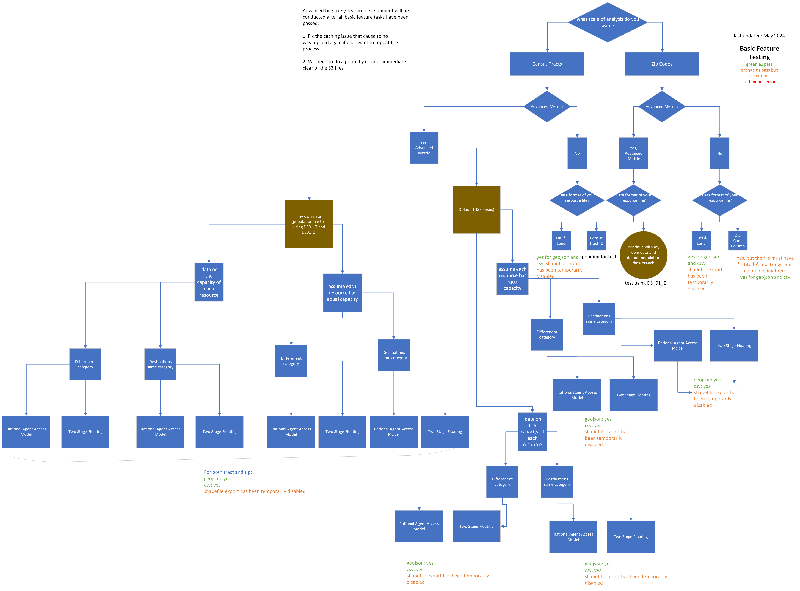
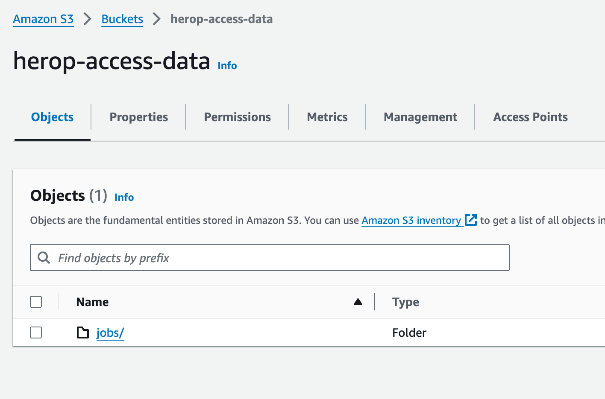
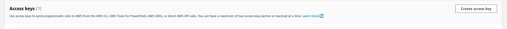
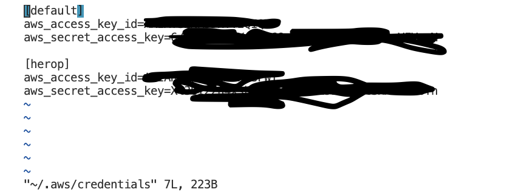
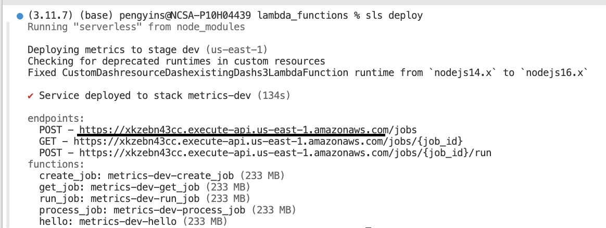
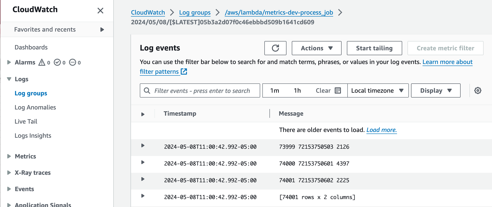
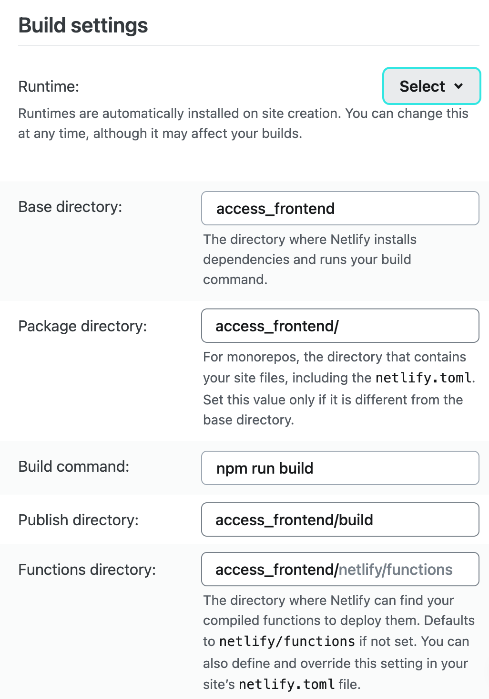
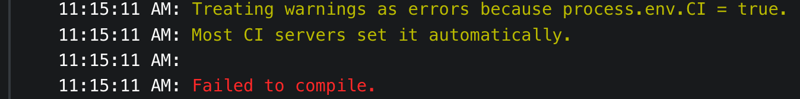

# Spatial Access App
[](https://app.netlify.com/sites/helpful-lollipop-5db1fd/deploys)

This repo contains the front-end code and the serverless lambda function specifications for running the spatial access application.

- [Roadmap](#roadmap)
- [A Step-by-Step Setup Guide using Serverless, AWS, and Netlify](#a-step-by-step-setup-guide-using-serverless-aws-and-netlify)

## App Use Flowchart

The Spatial Access app guides users through a series of steps that allow them to apply geographic access metrics to their own data.



## A Step-by-Step Setup Guide using Serverless, AWS, and Netlify

*Last updated on June 2024*

The following guide will help you create a deployment of the Spatial Access app.

### Provision AWS

1. Create an AWS account and set up an IAM user with the following policies. This is the minimum required for the IAM user to create AWS access keys and secret keys, as well as give serverless access to deploy the lambda functions and S3 buckets:

	```bash
	{
		"Version": "2012-10-17",
		"Statement": [
			{
				"Sid": "AllowViewAccountInfo",
				"Effect": "Allow",
				"Action": [
					"iam:GetAccountPasswordPolicy",
					"iam:GetAccountSummary",
					"iam:CreateRole",
					"iam:GetRole",
					"iam:TagUser",
					"iam:TagRole",
					"iam:PutRolePolicy",
					"iam:DeleteRolePolicy"
				],
				"Resource": "*"
			},
			{
				"Sid": "AllowManageOwnPasswords",
				"Effect": "Allow",
				"Action": [
					"iam:ChangePassword",
					"iam:GetUser"
				],
				"Resource": "arn:aws:iam::*:user/${aws:username}"
			},
			{
				"Sid": "ManageOwnAccessKeys",
				"Effect": "Allow",
				"Action": [
					"iam:CreateAccessKey",
					"iam:DeleteAccessKey",
					"iam:GetAccessKeyLastUsed",
					"iam:ListAccessKeys",
					"iam:UpdateAccessKey"
				],
				"Resource": [
					"arn:aws:iam::*:user/${aws:username}"
				]
			},
			{
				"Sid": "AccessAppControl",
				"Effect": "Allow",
				"Action": [
					"cloudformation:*",
					"cloudwatch:*",
					"apigateway:*",
					"s3:*",
					"lambda:*"
				],
				"Resource": "*"
			},
			{
				"Sid": "CloudFormationLogs",
				"Effect": "Allow",
				"Action": [
					"logs:*"
				],
				"Resource": "*"
			},
			{
				"Sid": "PassRoleWithResource",
				"Effect": "Allow",
				"Action": [
					"iam:PassRole"
				],
				"Resource": "arn:aws:iam::*:role/metrics-dev*"
			}
		]
	}
	```

2. Set up an S3 bucket for the processing steps. In your S3 account, create a bucket and a folder called `jobs` within the bucket to store the data for the calculations. 

	

	Note that S3 bucket name needs to be unique across all AWS accounts. So you may need to try different names if the bucket name is already taken.

3. Edit the bucket's CORS setting for your local and remote access. In the bucket, go to the `Permissions` tab and click on `CORS configuration`. Add the following CORS configuration:

	```xml
	[
		{
			"AllowedHeaders": [
				"*"
			],
			"AllowedMethods": [
				"GET",
				"PUT",
				"POST",
				"DELETE"
			],
			"AllowedOrigins": [
				"https://your_deoloyment_url",
				"http://localhost:3000"
			],
			"ExposeHeaders": []
		}
	]
	```

	Change the localhost port number if needed and set the deployment URL to your own (you can come back to this after the Netlify setup is completed).

4. Set up the AWS CLI on your machine and configure it with the IAM user's access keys and secret keys. Based on the policy above, users should be able to create access keys and secret keys for themselves. You should be use `Security credentials` in AWS menu to set up the AWS CLI on your machine:

	

	After you get access key and secret key, you can configure the AWS CLI on your machine:

	```bash
	aws configure
	```

	If you have multiple profiles, you can specify the profile name when configuring the AWS CLI:

	```bash
	sudo vim ~/.aws/credentials
	```
	

### Deploy Backend with Serverless

_For the rest of the steps, you will need to have [nodejs](https://nodejs.org/en/download/) installed._

1. If you don't have [serverless](https://www.serverless.com/) installed, install it by running the following command in your terminal

	```bash
	npm install -g serverless
	```

2. Clone the repository

	```bash
	git clone https://github.com/healthyregions/spatial-access && cd spatial-access
	```

3. Edit the `serverless.yml` file in `lambda_functions` folder to point to the correct bucket and path (created in the steps above):

	```yaml
	environment:
	# Bucket that is used to store the data for the calculations
	ACCESS_BUCKET: "your bucket name created in step 5"
	# Path within the bucket to be used to store the data
	ACCESS_PATH: "jobs"
	REGION_NAME: "your bucket region"
	...
	process_job:
		handler: geo_handler.process_job # trigger when there's creation in the S3 bucket
		timeout: 300
		memorySize: 10240
		events:
		- s3:
			bucket: your_bucket_name_created_in_step_5"
	```

	other settings could stay as default.

4. Install the `serverless-python-requirements` plugin at the root of the project:

	```bash
	npm install serverless-python-requirements
	```

5. In the `lambda_functions` folder, run the following command to deploy the application (note that the first time you run this command, it may take a while to install the dependencies):

	```bash
	sls deploy
	```

	If everything goes smoothly, you will get an endpoint for the generated API. Note this down to be able to connect the frontend:

	

	If not, see [Possible Problems & Solutions](#possible-problems--solutions) below.

6. In the `src/Hooks/useJobRunner.js` file, change the `BASE_URL` constant to be the one reported by serverless when you deployed:

	```javascript
	const BASE_URL = "URL reported by serverless in the last step"
	```

### Build Frontend

1. To build the frontend locally, run

	```bash
	cd access_frontend
	npm i
	npm start
	```

    This should open the application at http://localhost:3000. You can now use the Access App to process the data. You can check the data processing status in the S3 bucket you created in step 5, and possibly modify the codes in lambda_functions folder to see backend output to CloudWatch:

	

2. To deploy the frontend application to production, you can use [Netlify](https://netlify.com). Create an account on Netlify and link your GitHub repository to Netlify. We have ready prepare the `netlify.toml` file in the root of the `access_frontend` folder.

3. In the deployment configuration, set the Base directory to be `access_frontend` and set the build command to `npm run build` and the publish directory to `build`:

   

## Possible Problems & Solutions

- `Deployment bucket has been removed manually. Please recreate it or remove your service and attempt to deploy it again`: first of all, make sure your are using the correct aws profile, then remove the s3 bucket and try to deploy again.

- `CustomS3Bucket: AccessDenied: Access Denied`: make sure you have the correct permissions in the IAM user, and check to make sure you apply correct AWS profile & credentials.

- In the Netlify deployment, you may see the build fail with following message:

  

  To solve this, check all the warnings listed below this message and fix them. This error is because CI is enabled by default and CI treat warnings as errors. (You can disable CI in the Netlify deployment settings by setting `CI=false` in the environment variables, but this is not recommended.)
